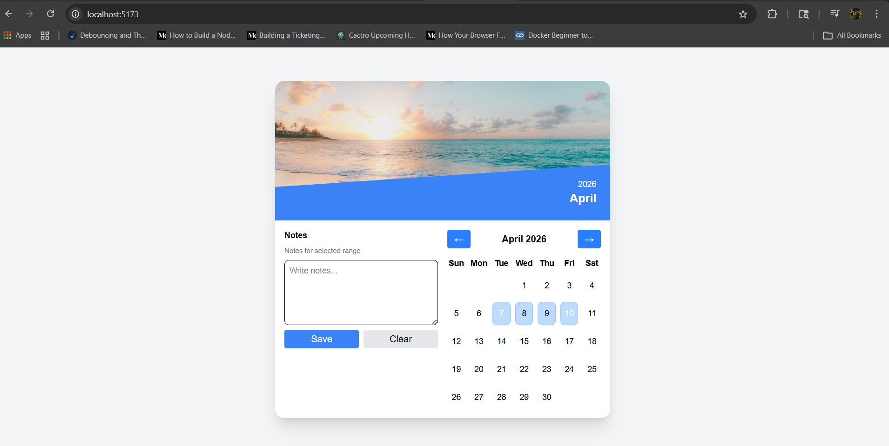

#  Wall Calendar Aesthetic 




##  Live Demo


> **URL:** [https://tuf-assign.vercel.app/](https://tuf-assign.vercel.app/)

---

##  Project Structure

```bash
frontend/
├── src/                      
│   │── index.jsx
│   │── app.jsx
│   │── index.css
│   ├── components/
│   │   │   ├── Calendar.jsx
│   │   │   ├── NotePanel.jsx
│   │   │   ├── CalendarHeader.jsx
│   │   │   ├── CalendarHeader.jsx
│   │   │   ├── ImageBanner.jsx
│   │   │
│   ├── utils/                    # Core logic
│   │  └── dateUtils.js
│   ├── hooks/                    # Custom Notes hook
│   │  └── useNotes.js
│
├── public/                       # Static assets & screenshots
│
├── README.md
├── package.json
└── tsconfig.json

```

---

##  Core Features


---

##  Tech Stack

### Frontend

* **JavaScript**
* **React**

### Styling

* **Tailwind CSS**


##  Getting Started

### 1. Clone Repository

```bash
git clone https://github.com/yadavshubham01/tuf_assign.git
cd financial Dashboard
```

### 2. Install Dependencies

```bash
npm install
```

### 3. Start Development Server

```bash
npm run dev
```

App will be available at:
 `http://localhost:5173`


##  Author

**Shubham Yadav**